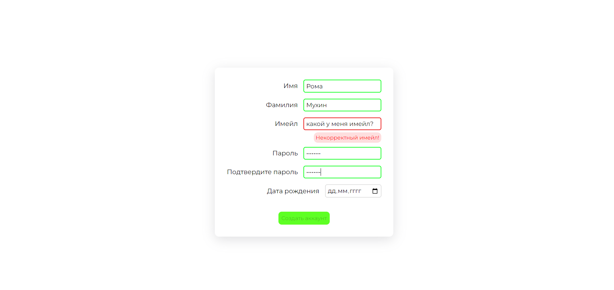

# Form with Validation

A web form with field validation using regular expressions.

## Features

- **Field Validation**: Ensures users enter correct values.
  - If a user inputs an incorrect value, an error message will appear below the field, and the field border will turn red.
  - The submit button is disabled until all the values in the fields are correct

## Live Demo

Check out the live demo on GitHub Pages: [Form with Validation](https://mkh1n.github.io/form-with-validation/)

## About

This form is a test task completed according to [this technical task](https://cloud.mail.ru/public/KN2F/TW4dPYs6n).
